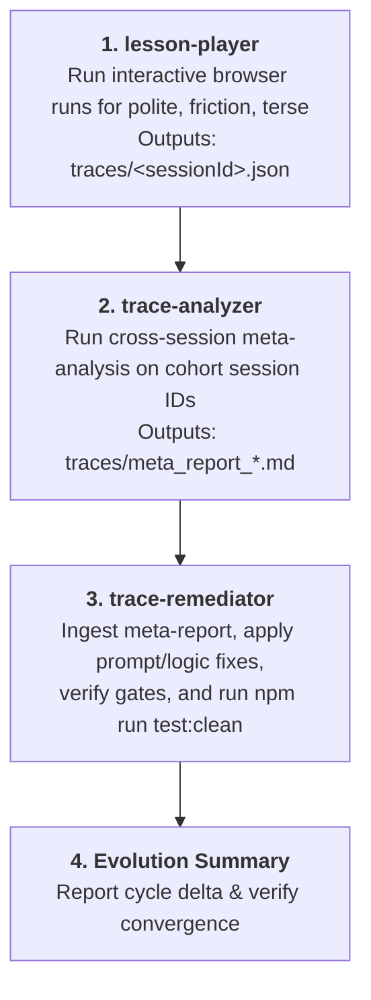

# Lesson Evolver Skill (Gabo)

This skill is the top-level meta-orchestrator for Gabo's autonomous feedback loop. Rather than duplicating individual tasks, it composes and coordinates the three specialized skills in sequence:

1. **[`lesson-player`](file:///Users/udo/Desktop/gabo/.agents/skills/lesson-player/SKILL.md)**: Generates flight-recorder traces via interactive browser playthroughs.
2. **[`trace-analyzer`](file:///Users/udo/Desktop/gabo/.agents/skills/trace-analyzer/SKILL.md)**: Audits traces with the LLM Judge and synthesizes a cohort meta-report.
3. **[`trace-remediator`](file:///Users/udo/Desktop/gabo/.agents/skills/trace-remediator/SKILL.md)**: Formulates fixes, updates prompts/code, validates test gates, and cleans up the resolved cohort.



---

## Orchestration Protocol

### Step 1: Simulate Learner Cohort via `lesson-player`

> **Delegate to:** [`lesson-player`](file:///Users/udo/Desktop/gabo/.agents/skills/lesson-player/SKILL.md) (**Mode A: Interactive Playthrough via Browser Subagent**).

Execute three sequential interactive browser playthroughs, one for each default persona:
1. **`polite`** persona (`RecordingName: 'play_polite'`) -> Capture returned `SESSION_ID_POLITE`.
2. **`friction`** persona (`RecordingName: 'play_friction'`) -> Capture returned `SESSION_ID_FRICTION`.
3. **`terse`** persona (`RecordingName: 'play_terse'`) -> Capture returned `SESSION_ID_TERSE`.

Confirm that all three sessions successfully generated flight-recorder traces in `traces/<sessionId>.json`.

---

### Step 2: Cross-Session Audit & Synthesis via `trace-analyzer`

> **Delegate to:** [`trace-analyzer`](file:///Users/udo/Desktop/gabo/.agents/skills/trace-analyzer/SKILL.md) (**Workflow 2: Cross-Session Meta-Analysis**).

Run the cross-session meta-analysis over the cohort session IDs captured in Step 1:

```bash
npm run test:analyze -- <SESSION_ID_POLITE> <SESSION_ID_FRICTION> <SESSION_ID_TERSE>
```

Confirm creation of the synthesized cohort report at `traces/meta_report_<timestamp>.md`.

---

### Step 3: Targeted Remediation, Verification & Cleanup via `trace-remediator`

> **Delegate to:** [`trace-remediator`](file:///Users/udo/Desktop/gabo/.agents/skills/trace-remediator/SKILL.md) (**Phases 1 through 5**).

Direct `trace-remediator` to ingest the newly created meta-report and execute:
1. **Report Extraction (Phase 1):** Identify recurring behavioral patterns (`[HIGH]`, `[MEDIUM]`), drop-off points, and prioritized prompt suggestions.
2. **Implementation (Phases 2 & 3):** Apply targeted modifications to scenario rubrics (`cafe-001.json`), Director (`director.ts`), Actor (`actor.ts`), or Reducer (`reducer.ts`).
3. **Verification Gate (Phase 4):** Verify stability with `npm run check` and `npm run test:unit`.
4. **Cohort Cleanup (Phase 5):** Execute `npm run test:clean` to prune the audited cohort traces and reports.

---

### Step 4: Cycle Summary & Next Iteration

Present a high-level summary to the user:
- **Evaluated Cohort:** Session IDs and personas played.
- **Key Diagnoses:** Primary bottlenecks and drop-off points uncovered in the meta-report.
- **Adjustments Made:** Prompts and code updated.
- **Verification Result:** Status of typecheck and unit tests.
- **Directory Status:** Confirmation that the cohort was cleanly pruned and ready for the next iteration.
